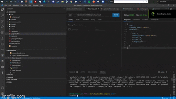
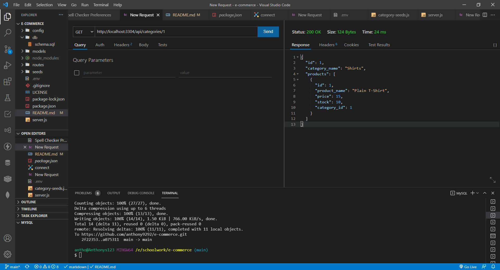

# e-commerce
MIT 

## Description
 Fully functioning back end for e-commerce site, using Sequalize to interact with a MySql database 
  
  ## Table of contents
  - [Description](#description)
  - [Table of contents](#table-of-contents)
  - [Installation](#installation)
  - [Images](#image)
  - [Youtube](#youtube)
  - [Technologies](#technologies)
  - [License](#license)
  - [Contributing](#contributing)
  - [Questions](#questions)

## Installation
to run this application clone the repo and run `npm i` in terminal. IN addition add the following .env file in the root folder with the following line: 
 `DB_name= 'ecommerce_db'
  DB_user='Personal MySql name'
  DB_P='Personal Password'

## Images 
Employee Demonstration GIF: 

Employee Pic: 

## Youtube 

# Technologies 
- Node.js
- dotenv
- nodemon
-  init.js
- Express.js
- sequelize
- MySql

## License MIT
I have used a mit License for this application, please see repository for documentation <https://github.com/anthony9292/Team-Generator-/blob/main/License.md>

## Contributing
   anthony9292

## Questions
For questions regarding this application please contact me at:
- E-mail anthon.n08@gmail.com 
- Github:<https://github.com/anthony9292>

    
